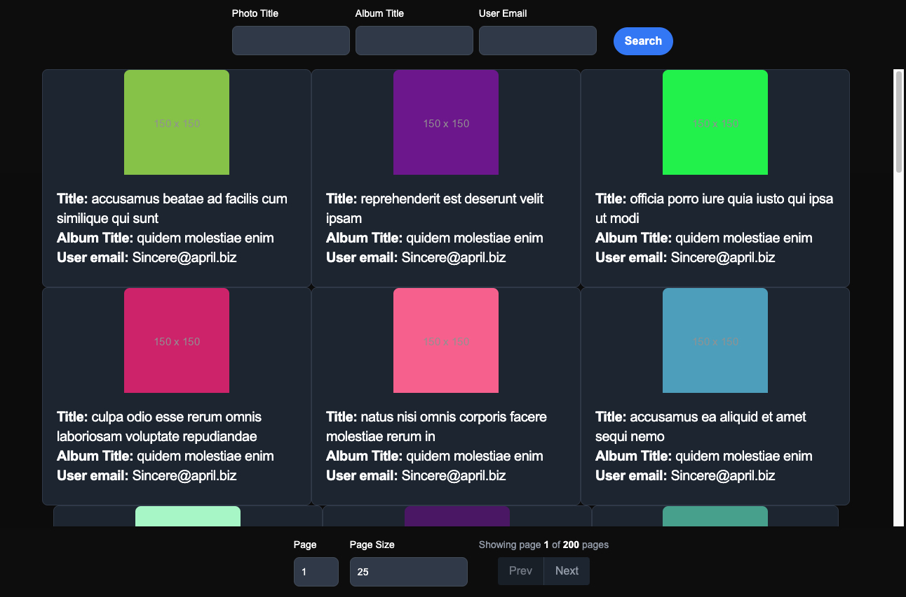
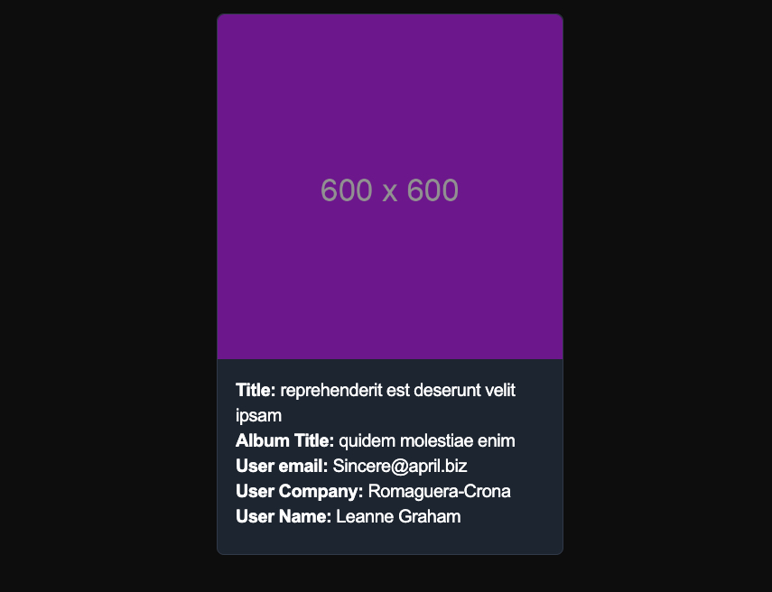

# Meta Photo

Full Stack application, that leverages https://jsonplaceholder.typicode.com/ endpoints to create an organized way to view all the photos.
It shows the Photos with the Album and User data.

### Technologies in this project

![Next.js][next-image] ![React.js][react-image] ![Node.js][node-image] ![Express.js][express-image] ![Typescript][typescript-image] ![TailwindCSS][tailwind-image]

## Project Description

This projects uses a frontend and an api, running it with Docker and has the following structure:
```bash
├── meta-photo
│   ├── api/
│   │   ├── **
│   │   └── Dockerfile
│   ├── frontend/
│   │   ├── **
│   └── └── Dockerfile
└── docker-compose.yml
```


## System Requirements

In order to run the project there are 2 alternatives:

- The easiest one is using Docker, you need to have [Docker](https://docs.docker.com/engine/install/) installed on your machine, its easier to install [Docker Desktop](https://www.docker.com/products/docker-desktop/)

- The other alternative is using Node, using NVM is easiest, since you can have multiple Node.js versions and you can use [this guide](https://www.freecodecamp.org/news/node-version-manager-nvm-install-guide/) in order to install it. Or you can just install Node, this project was created using `Node v20.15.0` and `Npm 10.7.0`

## Run the project

From the root of the project, run the following command to generate a `.env` file on the frontend
```
cp ./frontend/template.env ./frontend/.env
```

#### Run using docker

After that run the 
```
docker-compose up
```

Now you can visit http://localhost/photos in order to see the project running

#### Run using Node

From the root of the project, run the following command to generate a `.env` file for the api project
```
cp ./api/template.env ./api/.env
```

Run the api going to the root of the project with `cd api` and run:
```
npm run dev
```

Go back to the root with `cd ..` and go to the frontend with `cd frontend` and run:
```
npm run start
```

Now you can visit http://localhost:3000/photos in order to see the project running

##### API

The api inside `api/` is built with Node.js and Express, it enriches the information from 3 different sources:
- https://jsonplaceholder.typicode.com/users
- https://jsonplaceholder.typicode.com/albums
- https://jsonplaceholder.typicode.com/photos

It exposes 2 endpoints 
- `/externalapi/photos`
  - Returns: an Object with the following information:
    - page -> the current page [1-n]
    - pageCount -> the total number of pages
    - pages -> array with all the enriched Photos on that page
  - It returns all the enriched photos, by default limits it to 25 photos ands starts in page 0
  - You can set the following query parameters to filter the result:
    - title -> the Photo title
    - album.title -> the Album title
    - album.user.email -> the User's email
    - limit -> the maximum number of Photos to be returned
    - offset -> the page count, starting from [0-n]
- `externalapi/photos/:id`
  - Returns: the enriched Photo

##### Frontend

The frontend inside `frontend/` is built with React.js and Next.js, it uses the api to get the information from the enriched Photos and render them on the frontend.

As you can see on the image, there are 3 inputs on the top where you can filter the images based on title, album title and user email. And on the bottom, there's a page number and page size that you can modify to navigate through the Photos. The page and page size modification has a 700 ms wait time (with a debounce function) before doing the api call (it keeps the filters selected above).



If you click on a Photo it will render a few more details and a bigger image while doing a different api call.




<!-- Image Links -->
[next-image]: https://img.shields.io/badge/Next.js-black?logo=next.js&logoColor=white
[react-image]: https://img.shields.io/badge/React-%2320232a.svg?logo=react&logoColor=%2361DAFB
[node-image]: https://img.shields.io/badge/Node.js-6DA55F?logo=node.js&logoColor=white
[typescript-image]: https://img.shields.io/badge/TypeScript-3178C6?logo=typescript&logoColor=fff
[express-image]: https://img.shields.io/badge/Express.js-%23404d59.svg?logo=express&logoColor=%2361DAFB
[tailwind-image]: https://img.shields.io/badge/Tailwind%20CSS-%2338B2AC.svg?logo=tailwind-css&logoColor=white
